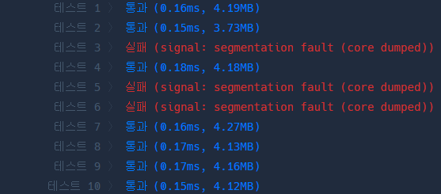

# DP 쉽게 생각하기

## 1. 문제 식별하기
먼저 문제를 DP로 풀 수 있는지 판별 해야합니다. 문제를 잘 읽고 다음을 식별합니다.

1. 최적 부분 구조를 가지고 있는가?
2. 중복되는 부분 문제를 가지고 있는가?

먼저 최적 부분 구조를 가지고 있지 않다면 어떤 문제의 부분 문제가 최적해를 보장하지 않는다면 DP를 적용할 수 없습니다. 그리고 중복되는 부분 문제를 가지고 있지 않다면, 메모이제이션을 이용하더라도 기존과 차이가 없을 것 입니다. 계산의 수가 동일하기 때문입니다.

## 2. 재귀를 이용한 완전 탐색으로 문제 해결하기
첫 단계는 재귀를 이용한 완전 탐색으로 문제를 해결하는 것입니다. 문제의 요구사항과 제약조건을 충실히 만족하도록 합시다. 무한 재귀에 빠지지 않도록 종료 조건 설정에 주의하고, 올바른 결과가 도출되도록 초기값을 올바르게 설정합니다.

``` cpp
#include <string>
#include <vector>
#include <iostream>

std::vector<std::vector<int>> problem;

// current_alp와 current_cop는 target_alp와 target_cop와 같기만 하면 더 늘리지 않아도 됩니다.
int solve(int current_alp, int current_cop, int time, int target_alp, int target_cop) {
    if (current_alp >= target_alp && current_cop >= target_cop) {
        return time;
    }
    
    int min = INT32_MAX;
    // 문제 안풀고 알고력 1 높이기
    if (current_alp < target_alp) {
        int a = solve(current_alp + 1, current_cop, time + 1, target_alp, target_cop);
        min = std::min(a, min);
    }
    
    // 문제 안풀고 코딩력 1 높이기
    if (current_cop < target_cop) {
        int b = solve(current_alp, current_cop + 1, time + 1, target_alp, target_cop);
        min = std::min(b, min);
    }
    
    // 문제 풀기
    for (int i = 0; i < problem.size(); i++) {
        if (problem[i][0] <= current_alp && problem[i][1] <= current_cop) {
            int next_alp = std::min(target_alp, current + problem[i][2]);
            int next_cop = std::min(target_cop, current + problem[i][3]);
            int c = solve(next_alp, next_cop, target_alp, target_cop);
            min = std::min(min, c);
        }
    }
    
    return min;
}

int solution(int alp, int cop, vector<vector<int>> problems) {
    problem = problems;
    int target_alp = INT32_MIN;
    int target_cop = INT32_MIN;
    for (auto vec : problems) {
        if (vec.size() >= 2) {
            target_alp = std::max(vec[0], target_alp);
            target_cop = std::max(vec[1], target_cop);
        }
    }
    
    return solve(alp, cop, 0, target_alp, target_cop);
}

int main() {
    auto result = solution(10, 10, {{10, 15, 2, 1, 2}, {20, 20, 3, 4, 4}});
    std::cout << result << '\n';
}
```

## 3. 필요없는 매개변수 제거하기
이제 재귀함수에서 필요없는 매개변수를 제거합니다. `target_alp`와 `target_cop`는 매 재귀 호출마다 고정된 값을 가지므로 캐시 테이블과 관련이 없습니다. 그리고 `time`은 캐시 테이블에 들어갈 값으로 정합니다. 이 때 캐시 테이블을 `dp[current_alp][currnet_cop]`는 `current_alp`와 `current_cop`가 매개 변수일 때의 결과로 정의합시다.

``` cpp
#include <string>
#include <vector>
#include <iostream>

using namespace std;

int target_alp = INT32_MIN;
int target_cop = INT32_MIN;
vector<vector<int>> problem;

std::vector<std::vector<int>> dp;
int solve(int current_alp, int current_cop) {
    if (current_alp >= target_alp && current_cop >= target_cop) {
        return 0; // 이제, 종료 조건 만족 시 0을 리턴하도록 합시다.
    }
    
    if (dp[current_alp][current_cop] != -1) {
        return dp[current_alp][current_cop];
    }
    
    int min = INT32_MAX;
    if (current_alp < target_alp) {
        // time 매개변수를 제거하고, 재귀 호출 결과에 더하여 계산합니다.
        int a = solve(current_alp + 1, current_cop) + 1; 
        dp[current_alp][current_cop] = min = std::min(a, min);
    }
    
    if (current_cop < target_cop) {
        int b = solve(current_alp, current_cop + 1) + 1;
        dp[current_alp][current_cop] = min = std::min(b, min);
    }
    
    // 문제 풀기
    for (int i = 0; i < problem.size(); i++) {
        if (problem[i][0] <= current_alp && problem[i][1] <= current_cop) {
            int next_alp = std::min(target_alp, current_alp + problem[i][2]);
            int next_cop = std::min(target_cop, current_cop + problem[i][3]);
            int next_time = problem[i][4];
            int c = solve(next_alp, next_cop) + next_time;
            min = std::min(min, c);
        }
    }
    
    return dp[current_alp][current_cop] = min;
}

int solution(int alp, int cop, vector<vector<int>> problems) {
    problem = problems;
    for (auto vec : problems) {
        if (vec.size() >= 2) {
            target_alp = std::max(vec[0], target_alp);
            target_cop = std::max(vec[1], target_cop);
        }
    }
    dp.resize(300, std::vector<int>(300, -1));
    return solve(alp, cop);
}
```

## 4. 메모이제이션에서 다이나믹 프로그래밍으로 변환하기
대부분의 문제는 이 과정을 거치면 해결할 수 있습니다. 그러나 실제로 채점을 수행하면 다음과 같이 `segfault`가 발생하는 케이스가 존재하여 풀이가 불가능합니다. \



이는 재귀 호출을 수행하면서 호출 깊이가 너무 깊어져 스택 오버플로우가 발생하는 경우가 됩니다. 메모이제이션을 통해 깊이를 줄였음에도 불구하고 이런 문제가 발생한다면 아래와 같은 과정을 따릅니다.

1. 가지치기를 조금 더 수행할 수 있는 방법은 없는가? 이 경우는 문제에 대해서 조금 더 생각해 보아야 합니다.
2. 재귀 함수를 사용하는 것이 아니라 반복을 사용합니다.

2번을 택하는 경우 생각을 거의 하지않고 변환할 수 있습니다. 함수 호출 부분을 캐시 테이블 참조로 변경하면 됩니다. 시작 조건을 초기화해주고, 테이블의 정의에 따라 `for` 루프를 작성합니다.

``` cpp
int solution(int alp, int cop, std::vector<std::vector<int>> problems) {
    int target_alp = INT32_MIN;
    int target_cop = INT32_MIN;
    for (auto vec : problems) {
        if (vec.size() >= 2) {
            target_alp = std::max(vec[0], target_alp);
            target_cop = std::max(vec[1], target_cop);
        }
    }
    std::vector<std::vector<int>> dp(300, std::vector<int>(300, INT32_MAX));

    alp = std::min(target_alp, alp); 
    cop = std::min(target_cop, cop);
    dp[alp][cop] = 0;
    for (int i = alp; i <= target_alp; i++) {
        for (int j = cop; j <= target_cop; j++) {
            if (i < target_alp) {
                dp[i + 1][j] = std::min(dp[i + 1][j], dp[i][j] + 1);
            }
            
            if (j < target_cop) {
                dp[i][j + 1] = std::min(dp[i][j + 1], dp[i][j] + 1);
            }
            
            for (size_t k = 0; k < problems.size(); k++) {
                if (problems[k][0] <= i && problems[k][1] <= j) { 
                    int next_i = std::min(target_alp, i + problem[k][2]);
                    int next_j = std::min(target_cop, j + problem[k][3]);
                    int time_cost = problems[k][4];
                    dp[next_i][next_j] = std::min(dp[next_i][next_j], dp[i][j] + time_cost); 
                }
            }
        }
    }
    
    return dp[target_alp][target_cop];
}
```

## 추천 문제
### 백준
2098 (외판원 순회), 1149 (RGB거리), 11049 (행렬 곱셈 순서), 2579 (계단 오르기), 12865 (평범한 배낭)